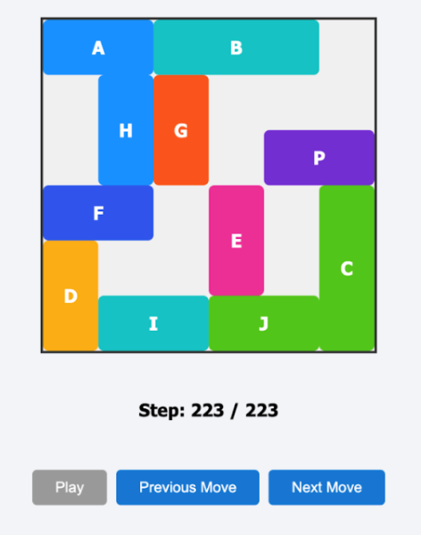

# <h1 align="center">Tugas Kecil 3 IF2211 Strategi Algoritma</h1>
<h2 align="center">Semester II tahun 2024/2025</h2>
<h3 align="center">Solving Rush Hour 2 Puzzle Using Pathfinding Algoruthm</h3>

<p align="center">
  
</p>

## Table of Contents
- [Description](#description)
- [Program Structure](#program-structure)
- [Requirements & Installation](#requirements--installation)
- [Author](#author)


## Description
This program solves the Rush Hour puzzle, where the objective is to slide vehicles on a grid to clear a path for the primary vehicle (usually red) to exit the board. Vehicles can only move forward or backward along their fixed horizontal or vertical orientation without overlapping or rotating.

The board contains multiple pieces with various sizes and orientations, but only the primary piece can exit through a designated exit point on the edge of the board.

The solver uses pathfinding algorithms—Greedy Best First Search, Uniform Cost Search (UCS), and A*—to find the optimal moves to solve the puzzle. Users can choose the algorithm and heuristics, with support for multiple heuristic options. Each algorithm runs independently based on user input.

## Program Structure
### Backend
```
.
├── algorithm
│   ├── AStar.java
│   ├── BidirectionalSolver.java
│   ├── BoardNode.java
│   ├── BoardToJsonConverter.java
│   ├── GreedyBestFirstSearch.java
│   ├── Heuristic.java
│   └── UCS.java
├── block
│   └── Block.java
├── board
│   └── Board.java
├── Main.java
└── utils
    └── InputOutput.java
```

### Frontend
```
.
├── package.json
├── package-lock.json
├── public
│   ├── index.html
│   ├── manifest.json
│   └── robots.txt
├── server.js
├── src
│   ├── App.css
│   ├── App.js
│   ├── components
│   │   ├── Board.css
│   │   ├── Board.js
│   │   └── Colors.js
│   └── index.js
└── test
    └── public
        └── solution.json
```


## Requirements & Installation

Before running the application, you need to have Node.js installed on your system.

To set up the project make sure to follow this instruction:

```bash
git clone https://github.com/barruadi/Tucil3_13523101_13523115
cd Tucil3_13523101_13523115/src/frontend
npm install
```
Once the instalation complete,
```bash
npm run start
```

Once the build is complete, the application will be available at:  
[http://localhost:3000](http://localhost:3000)

## How To Use

On the right side of the interface, there is a control panel where you can select the pathfinding algorithm to use, choose the heuristic method, and upload the input file representing the puzzle configuration. Once everything is set, clicking the **Start** button will begin the solving process.

After computation, the solution will be displayed visually through an animation that shows each step taken to solve the puzzle. This interactive approach allows you to clearly observe how the selected algorithm works in guiding the primary vehicle toward the exit.


## Author
| **NIM**  | **Nama Anggota**               | **Github** |
| -------- | ------------------------------ | ---------- |
| 13523101 | Barru Adi Utomo                | [barruadi](https://github.com/barruadi) |
| 13523115 | Azfa Radhiyya Hakim            | [azfaradhi](https://github.com/azfaradhi) | 
